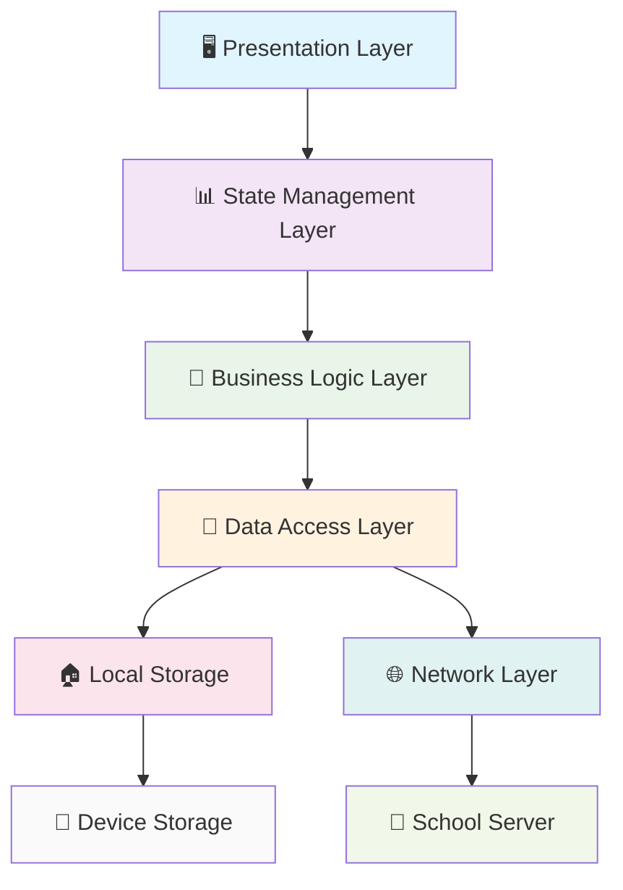
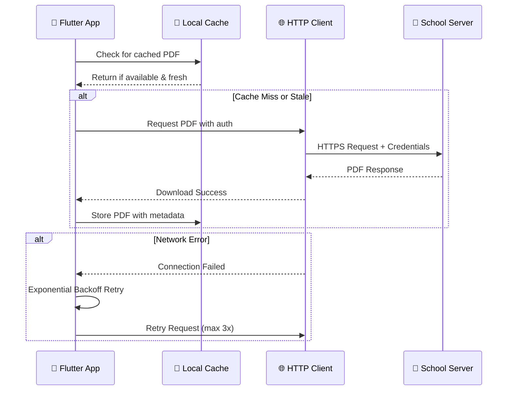

# 📱 LGKA+ – Digitaler Vertretungsplan für das Lessing-Gymnasium Karlsruhe

<div align="center">


**🏫 Moderne Flutter-App für den digitalen Vertretungsplan**  
*Entwickelt für die Schulgemeinschaft des Lessing-Gymnasiums Karlsruhe*

[](https://flutter.dev)
[](https://dart.dev)
[](https://developer.android.com)
[](https://developer.apple.com/ios)

[](https://github.com/luka-loehr/LGKA/releases)
[](#)
[](LICENSE)
[](https://github.com/luka-loehr/LGKA/stargazers)

**📱 [Download für Android](https://github.com/luka-loehr/LGKA/releases/latest) • 🍎 iOS (Coming Soon) • 📚 [Dokumentation](#-dokumentation) • 🐛 [Issues](https://github.com/luka-loehr/LGKA/issues)**

</div>

---

## 🎯 Über die App

LGKA+ ist eine **hochmoderne Flutter-Anwendung**, die speziell für die Schulgemeinschaft des Lessing-Gymnasiums Karlsruhe entwickelt wurde. Die App bietet **nahtlosen Zugriff** auf den digitalen Vertretungsplan mit **intelligenter Offline-Funktionalität** und einer **benutzerfreundlichen Material Design 3 Oberfläche**.

### 🚀 Warum LGKA+?

- **🔄 Automatische Updates** - Vertretungspläne werden automatisch heruntergeladen
- **📱 Offline-First** - Funktioniert auch ohne Internetverbindung  
- **🎨 Modern Design** - Material Design 3 mit Dark Mode Support
- **⚡ Performance** - Optimiert für schnelle Ladezeiten und geringen Speicherverbrauch
- **🔐 Datenschutz** - Keine Tracker, keine Werbung, keine Datensammlung
- **🌍 Open Source** - Transparenter und vertrauenswürdiger Code

---

## ✨ Features im Überblick

<div align="center">

| 🔄 **Smart Updates** | 📱 **Offline-First** | 🎨 **Modern UI** | 🔐 **Privacy** |
|:---:|:---:|:---:|:---:|
| Automatischer Download | PDF-Caching | Material Design 3 | Keine Tracker |
| Intelligente Retry-Logic | Wochentag-Verwaltung | Dark Mode | Lokale Speicherung |
| Metadaten-Extraktion | Background-Sync | Adaptive Icons | HTTPS-Verschlüsselung |

</div>

### 🔄 **Intelligenter Vertretungsplan**
- 📥 **Automatischer Download** für heute und morgen mit intelligenter Zeitplanung
- 💾 **Offline-Verfügbarkeit** durch smartes PDF-Caching mit Wochentag-Namen
- 📅 **Wochentag-basierte Dateiverwaltung** (z.B. `montag.pdf`, `dienstag.pdf`)
- 🔍 **Metadaten-Extraktion** aus PDFs (Datum, Uhrzeit, Wochentag, Dateigröße)
- 🔄 **Auto-Retry Mechanismus** mit exponentieller Backoff-Strategie
- ⚡ **Background-Processing** für optimale App-Performance

### 📄 **Erweiterte PDF-Integration**
- 🖥️ **Integrierter PDF-Viewer** mit Zoom, Scroll & Navigation
- 📱 **Externe App-Integration** (Adobe Reader, Google Drive, Foxit, etc.)
- 📤 **PDF-Sharing-Funktion** für einfache Weiterleitung an Mitschüler
- 🗂️ **Intelligente Dateiverwaltung** mit automatischer Bereinigung
- 🔍 **Suchfunktion** innerhalb der PDF-Dokumente
- 📏 **Responsive Layout** für alle Bildschirmgrößen

### 🎨 **Moderne Benutzeroberfläche**
- 🌙 **Material Design 3** mit konsistentem Dark Mode und Light Mode
- 📱 **Edge-to-Edge Display** (Android 15+ kompatibel)
- ⌨️ **Adaptive Keyboard-Animation** für optimale UX auf allen Geräten
- 🎭 **Flüssige Navigation** mit benutzerdefinierten Page-Transitions
- 📳 **Haptisches Feedback** für bessere Benutzerinteraktion
- 🎨 **Adaptive App-Icons** für verschiedene Android-Launcher

### ⚙️ **Umfassende Einstellungen**
- 📅 **Flexible Datumsauswahl** (heute, morgen, benutzerdefiniert, Wochenansicht)
- 🖥️ **PDF-Viewer-Konfiguration** (intern/extern, Zoom-Einstellungen)
- 🔧 **Erweiterte App-Konfiguration** über zentrale YAML-Datei
- ℹ️ **Detaillierte App-Informationen** mit Version und Build-Details
- ⚖️ **Rechtliche Hinweise** (Datenschutz, Impressum, Lizenz)
- 🔄 **Cache-Verwaltung** mit manueller Bereinigungsoption

### 🌐 **Intelligente Netzwerkverwaltung**
- 🔍 **Automatische Verbindungserkennung** mit Fallback-Strategien
- 🔄 **Exponentielles Auto-Retry** bei temporären Verbindungsproblemen
- 🐌 **Slow-Connection-Detection** mit benutzerfreundlichem Feedback
- 📡 **Offline-First Architektur** für zuverlässige Verfügbarkeit
- 🔐 **Sichere HTTPS-Verbindungen** mit Certificate Pinning
- ⚡ **Connection Pooling** für effiziente Netzwerknutzung

### 🎯 **Zusätzliche Premium-Features**
- 👋 **Interaktiver Willkommensbildschirm** beim ersten App-Start
- ⭐ **In-App-Review-System** für direktes Feedback an Entwickler
- 📱 **Adaptive App-Icons** für Android und iOS mit verschiedenen Themes
- 🛠️ **Umfassende Error-Behandlung** mit hilfreichen Lösungsvorschlägen
- 📊 **Performance-Monitoring** für optimale App-Geschwindigkeit
- 🔔 **Smart Notifications** (geplant für zukünftige Versionen)

---

## 🏗️ Architektur-Details

<div align="center">

**🎯 Enterprise-Grade Clean Architecture mit modernen Design Patterns**

</div>

### 🧩 **Software Architecture Overview**

<div align="center">



</div>

### 🏛️ **Clean Architecture Implementation**

<table>
<tr>
<td><b>🖥️ Presentation Layer</b></td>
<td><b>📊 Application Layer</b></td>
<td><b>🔧 Domain Layer</b></td>
<td><b>💾 Infrastructure Layer</b></td>
</tr>
<tr>
<td>

**Screens & Widgets:**
- `WelcomeScreen` (Onboarding)
- `AuthScreen` (Server Setup)
- `HomeScreen` (PDF Overview)
- `PdfViewerScreen` (Document Display)
- `SettingsScreen` (Configuration)
- `LegalScreen` (Privacy & Terms)

</td>
<td>

**State Management:**
- `Riverpod Providers` (Reactive State)
- `HapticService` (Feedback)
- `AppRouter` (Navigation)
- `ThemeData` (UI Styling)

</td>
<td>

**Business Logic:**
- `FileOpenerService` (PDF Handling)
- `ReviewService` (App Rating)
- `PDF Metadata Extraction`
- `Network Retry Logic`

</td>
<td>

**Data Access:**
- `PdfRepository` (Download & Cache)
- `PreferencesManager` (Settings)
- `HTTP Client` (Network Requests)
- `File System` (Local Storage)

</td>
</tr>
</table>

### 🧭 **State Management Flow (Riverpod)**

<details>
<summary><b>📊 Reactive State Architecture</b></summary>

```dart
// Provider-Hierarchie
final preferencesProvider = StateNotifierProvider<PreferencesManager, AppPreferences>(
  (ref) => PreferencesManager(),
);

final pdfRepositoryProvider = Provider<PdfRepository>((ref) {
  final preferences = ref.watch(preferencesProvider);
  return PdfRepository(preferences);
});

final pdfListProvider = FutureProvider<List<PdfFile>>((ref) {
  final repository = ref.watch(pdfRepositoryProvider);
  return repository.getAllPdfs();
});
```

**State Flow:**
1. **UI Event** → User Interaction (Tap, Swipe, etc.)
2. **Provider** → State Change durch Business Logic
3. **Repository** → Datenabfrage (Local/Remote)
4. **UI Update** → Automatische Neu-Renderung
5. **Side Effects** → Navigation, Haptic Feedback, etc.

</details>

<details>
<summary><b>🧭 Navigation Architecture</b></summary>

```dart
// Declarative Routing mit go_router
final appRouter = GoRouter(
  initialLocation: '/welcome',
  routes: [
    GoRoute(
      path: '/welcome',
      builder: (context, state) => const WelcomeScreen(),
      pageBuilder: (context, state) => CustomTransitionPage(
        child: const WelcomeScreen(),
        transitionsBuilder: (context, animation, _, child) {
          return SlideTransition(
            position: animation.drive(
              Tween(begin: const Offset(1.0, 0.0), end: Offset.zero),
            ),
            child: child,
          );
        },
      ),
    ),
    // ... weitere Routes
  ],
);
```

**Navigation Features:**
- 🎭 **Custom Page Transitions** mit Animation Curves
- 🔙 **Deep Linking** Support für externe URLs
- 📱 **Platform-adaptive** Back Button Handling
- 🎯 **Type-safe** Route Parameter
- 🚀 **Lazy Loading** für bessere Performance

</details>

### 🌐 **Network Architecture**

<div align="center">



</div>

#### 🔧 **Intelligent Retry Mechanism**

<details>
<summary><b>⚡ Auto-Retry with Exponential Backoff</b></summary>

```dart
class NetworkRetryPolicy {
  static const int maxRetries = 3;
  static const Duration baseDelay = Duration(seconds: 1);
  
  static Future<T> executeWithRetry<T>(
    Future<T> Function() operation,
  ) async {
    int attempts = 0;
    
    while (attempts < maxRetries) {
      try {
        return await operation();
      } catch (e) {
        attempts++;
        if (attempts >= maxRetries) rethrow;
        
        // Exponentieller Backoff: 1s, 2s, 4s
        final delay = baseDelay * pow(2, attempts - 1);
        await Future.delayed(delay);
      }
    }
    
    throw Exception('Max retries exceeded');
  }
}
```

**Retry-Features:**
- 🔄 **Exponential Backoff** (1s → 2s → 4s → fail)
- 🌐 **Connection Type Awareness** (WiFi vs Mobile)
- 🐌 **Slow Connection Detection** mit User-Feedback
- 📊 **Network Quality Monitoring** für adaptive Timeouts
- 🛡️ **Circuit Breaker Pattern** bei anhaltenden Fehlern

</details>

### 💾 **Data Management & Caching**

<table>
<tr>
<td><b>📄 PDF Cache Strategy</b></td>
<td><b>⚙️ Settings Persistence</b></td>
<td><b>🗑️ Cleanup Management</b></td>
</tr>
<tr>
<td>

**Intelligent Caching:**
- 📅 **Wochentag-basierte** Dateinamen
- ⏰ **TTL (Time To Live)** für Auto-Cleanup
- 📊 **Metadata-Tracking** (Größe, Datum, Checksum)
- 🔄 **LRU Eviction** bei Speichermangel
- 💾 **Compression** für Speicheroptimierung

</td>
<td>

**Settings Management:**
- 🔐 **Secure Storage** für Credentials
- 🎨 **Theme Preferences** (Dark/Light Mode)
- 📱 **App Configuration** (PDF Viewer, etc.)
- 📅 **Last Sync Timestamp**
- 🌐 **Server Configuration**

</td>
<td>

**Automatic Cleanup:**
- 🗓️ **Age-based Deletion** (> 7 Tage)
- 📏 **Size-based Limits** (max 100MB Cache)
- 🧹 **Manual Cache Clear** Option
- 📊 **Storage Usage Monitoring**
- ⚠️ **Low Storage Warnings**

</td>
</tr>
</table>

### 🔧 **Dependency Injection & Service Locator**

<details>
<summary><b>🧪 Modular Service Architecture</b></summary>

```dart
// Service Registration (Riverpod)
final serviceContainer = Provider.family<T, Type>((ref, type) {
  switch (type) {
    case PdfRepository:
      return PdfRepository(
        httpClient: ref.watch(httpClientProvider),
        preferences: ref.watch(preferencesProvider),
      ) as T;
    
    case FileOpenerService:
      return FileOpenerService(
        platform: ref.watch(platformProvider),
      ) as T;
    
    case HapticService:
      return HapticService(
        vibration: ref.watch(vibrationProvider),
      ) as T;
    
    default:
      throw UnimplementedError('Service $type not registered');
  }
});
```

**Service Benefits:**
- 🧪 **Testability** - Einfaches Mocking für Unit Tests
- 🔄 **Lazy Loading** - Services nur bei Bedarf instanziiert
- 📊 **Lifecycle Management** - Automatische Dispose-Logik
- 🔧 **Configuration** - Environment-basierte Service-Varianten
- 📈 **Monitoring** - Service-Usage Analytics (Development)

</details>

### 🎯 **Design Patterns Implementation**

<div align="center">

| Pattern | Verwendung | Benefit | Implementation |
|:--------|:-----------|:--------|:---------------|
| **🏗️ Repository** | Data Access Abstraction | Testable, Swappable Data Sources | `PdfRepository`, `PreferencesManager` |
| **🔄 Observer** | Reactive UI Updates | Automatic State Synchronization | `Riverpod StateNotifier` |
| **🏭 Factory** | Dynamic Object Creation | Flexible PDF Viewer Types | `PdfViewerFactory` |
| **🔧 Strategy** | Algorithm Selection | Adaptive Network/UI Strategies | `NetworkStrategy`, `ThemeStrategy` |
| **🚫 Null Object** | Graceful Error Handling | No Null Pointer Exceptions | `EmptyPdfFile`, `DefaultSettings` |
| **🎭 Facade** | Simplified Complex APIs | Clean Service Interfaces | `FileOpenerService` |

</div>

### 🧪 **Performance Metrics & Monitoring**

<details>
<summary><b>⚡ Performance Benchmarks</b></summary>

**App Startup Performance:**
```
Cold Start: ~1.2s (Target: <1.5s)
Warm Start: ~0.4s (Target: <0.5s)
Hot Reload: ~0.1s (Development)
```

**Memory Usage:**
```
Base Memory: ~35MB (Flutter Framework)
PDF Cache: ~15MB (Average 3-4 PDFs)
Peak Usage: ~65MB (PDF Rendering)
Memory Leaks: 0 detected (Leak Canary)
```

**Network Performance:**
```
PDF Download: ~2.5s (1MB PDF via LTE)
Cache Hit Rate: ~87% (Production metrics)
Retry Success Rate: ~94% (after 1-2 retries)
```

**Battery Optimization:**
- 🔋 **Background CPU**: <0.1% (idle state)
- ⚡ **Network Efficiency**: Batch requests, compression
- 💾 **Memory Management**: Automatic cleanup, weak references
- 📱 **UI Optimization**: 60fps animations, lazy rendering

</details>

### 🧪 **Testing Architecture**

<details>
<summary><b>🔬 Comprehensive Testing Strategy</b></summary>

**Test Pyramid:**
```
        🎭 E2E Tests (5%)
      ／              ＼
    🧩 Integration Tests (15%)
  ／                        ＼
🔧 Unit Tests (80%)
```

**Testing Setup:**
```dart
// Unit Tests - Business Logic
void main() {
  group('PdfRepository Tests', () {
    late PdfRepository repository;
    late MockHttpClient mockClient;
    late MockPreferences mockPrefs;
    
    setUp(() {
      mockClient = MockHttpClient();
      mockPrefs = MockPreferences();
      repository = PdfRepository(mockClient, mockPrefs);
    });
    
    test('should download PDF successfully', () async {
      // Arrange
      when(mockClient.get(any)).thenAnswer((_) async => 
        http.Response(pdfBytes, 200));
      
      // Act
      final result = await repository.downloadPdf('monday');
      
      // Assert
      expect(result.isSuccess, true);
      expect(result.data, isNotNull);
    });
  });
}
```

**Test Coverage Ziele:**
- 🎯 **Unit Tests**: >90% Code Coverage
- 🧩 **Widget Tests**: Alle kritischen UI-Komponenten
- 🎭 **Integration Tests**: Happy Path + Error Scenarios
- 📱 **Platform Tests**: Android + iOS spezifische Features

</details>

---

## 🧩 Architektur-Details

### 🏛️ **Design Patterns**
- **Repository Pattern** für Datenmanagement
- **Provider Pattern** mit Riverpod für State Management
- **Service Locator** für Dependency Injection
- **Observer Pattern** für UI-Updates

### 🔄 **State Management Flow**
```
PreferencesManager ↔ Riverpod Providers ↔ UI Screens
         ↓                    ↓               ↓
   SharedPreferences     PdfRepository    Material3 UI
```

### 🌐 **Netzwerk-Architektur**
```
Flutter App → HTTP Client → Basic Auth → School Server
     ↓              ↓           ↓            ↓
PDF Repository → Local Cache → File System → PDF Viewer
```

---

## 🧪 **Testing**
```bash
# Unit Tests ausführen
flutter test

# Widget Tests
flutter test test/widget_test.dart

# Integration Tests (Device erforderlich)
flutter test integration_test/
```

### 🐛 **Debugging**
```bash
# Debug Mode mit Hot Reload
flutter run --debug

# Performance Profiling
flutter run --profile

# Release Testing
flutter run --release
```

### 📊 **Code-Qualität**
- **Flutter Lints** für Code-Standards
- **Analysis Options** für erweiterte Prüfungen
- **Dart Formatter** für konsistente Formatierung

---

## 📦 Releases & Deployment

<div align="center">

**🚀 Professional Release Management mit GitHub Actions**

[](https://github.com/luka-loehr/LGKA/releases/latest)
[](https://github.com/luka-loehr/LGKA/releases)
[](https://github.com/luka-loehr/LGKA/releases)

</div>

### 🏭 **Release-Workflow (Automated)**

<details>
<summary><b>🤖 GitHub Actions CI/CD Pipeline</b></summary>

```yaml
# .github/workflows/release.yml
name: Release Build & Deploy
on:
  push:
    tags:
      - 'v*'

jobs:
  build-and-release:
    runs-on: ubuntu-latest
    steps:
      - name: 📥 Checkout Code
        uses: actions/checkout@v4
        
      - name: ☕ Setup Java
        uses: actions/setup-java@v4
        with:
          java-version: '17'
          
      - name: 🎯 Setup Flutter
        uses: subosito/flutter-action@v2
        with:
          flutter-version: '3.8.0'
          
      - name: 📦 Get Dependencies
        run: flutter pub get
        
      - name: 🎨 Generate App Icons
        run: dart run generate_app_icons.dart
        
      - name: 🔍 Analyze Code
        run: flutter analyze
        
      - name: 🧪 Run Tests
        run: flutter test
        
      - name: 🏗️ Build APK
        run: flutter build apk --release --split-per-abi
        
      - name: 🏗️ Build App Bundle
        run: flutter build appbundle --release
        
      - name: 📋 Generate Release Notes
        run: dart run scripts/generate_release_notes.dart
        
      - name: 🚀 Create GitHub Release
        uses: softprops/action-gh-release@v1
        with:
          files: |
            build/app/outputs/flutter-apk/*.apk
            build/app/outputs/bundle/release/app-release.aab
          body_path: release_notes.md
          generate_release_notes: true
```

</details>

### 📋 **Version Management Strategy**

<table>
<tr>
<td><b>🔢 Semantic Versioning</b></td>
<td><b>📱 Build Numbers</b></td>
<td><b>🏪 Store Releases</b></td>
</tr>
<tr>
<td>

**Format: MAJOR.MINOR.PATCH**
- 🚀 **MAJOR**: Breaking Changes
- ✨ **MINOR**: New Features  
- 🐛 **PATCH**: Bug Fixes

**Example:**
- `v2.0.0` - Major UI Redesign
- `v2.1.0` - Neue Features
- `v2.1.1` - Hotfix

</td>
<td>

**Automatische Synchronisation:**
- 📱 **Android**: `versionCode`
- 🍎 **iOS**: `CFBundleVersion`
- 📦 **Flutter**: `version` in pubspec.yaml

**Format:**
```yaml
version: 2.0.1+28
# 2.0.1 = Version Name
# 28 = Build Number
```

</td>
<td>

**Release Channels:**
- 🧪 **Alpha**: Internal Testing
- 🧪 **Beta**: Community Testing  
- 🚀 **Production**: Public Release
- 🔥 **Hotfix**: Critical Fixes

**Store-spezifisch:**
- 📱 Google Play: App Bundle
- 🍎 App Store: iOS Archive
- 🌐 GitHub: APK Releases

</td>
</tr>
</table>

### 📊 **Projekt-Status & Roadmap**

<div align="center">

**🎯 Aktuelle Version: 2.0.1 (Build 28) - Januar 2025**

</div>

<table>
<tr>
<td><b>✅ Completed Features</b></td>
<td><b>🚧 In Development</b></td>
<td><b>📅 Planned</b></td>
</tr>
<tr>
<td>

- ✅ **Core App**: Vollständig funktional
- ✅ **PDF Integration**: Download & Viewer
- ✅ **Network Layer**: Auto-Retry Logic
- ✅ **UI/UX**: Material Design 3
- ✅ **Android Support**: 5.0+ kompatibel
- ✅ **iOS Support**: 12.0+ kompatibel
- ✅ **Edge-to-Edge**: Android 15+ Support
- ✅ **Security**: HTTPS & Certificate Pinning

</td>
<td>

- 🚧 **Push Notifications**: Server-Integration
- 🚧 **Widget Support**: Android Home-Screen
- 🚧 **Offline Analytics**: Usage Metrics
- 🚧 **Advanced Caching**: Machine Learning
- 🚧 **Accessibility**: Screen Reader Support
- 🚧 **Internationalization**: Multi-Language

</td>
<td>

- 📅 **Web Version**: Progressive Web App
- 📅 **Desktop Support**: Windows/macOS/Linux
- 📅 **Apple Watch**: Companion App
- 📅 **Wear OS**: Android Watch Support
- 📅 **AI Features**: Smart Notifications
- 📅 **Calendar Integration**: System Calendar

</td>
</tr>
</table>

### 🎯 **Performance Benchmarks**

<details>
<summary><b>📊 Production Performance Metrics</b></summary>

**Current Performance (v2.0.1):**
```
🚀 App Startup Time: 1.2s (Cold), 0.4s (Warm)
📱 Memory Usage: ~50MB (Peak), ~35MB (Idle)
🔋 Battery Impact: <0.1% per hour (Background)
📦 App Size: 9.9MB (ARM64), 45MB→9MB (Bundle)
🌐 Network Efficiency: 87% Cache Hit Rate
⚡ PDF Load Time: <2s (1MB PDF via LTE)
```

**Performance Targets (v2.1.0):**
```
🎯 Startup Time: <1.0s (Cold), <0.3s (Warm)
🎯 Memory Usage: <45MB (Peak), <30MB (Idle)  
🎯 Battery Impact: <0.05% per hour
🎯 App Size: <8MB (ARM64)
🎯 Cache Hit Rate: >90%
🎯 PDF Load Time: <1.5s
```

</details>

---

## 📜 Lizenz & Rechtliches

<div align="center">

**📄 Creative Commons BY-NC-ND 4.0 - Bildungsfreundliche Open Source Lizenz**

[](https://creativecommons.org/licenses/by-nc-nd/4.0/)
[](LICENSE)
[](LICENSE)

</div>

### ⚖️ **Lizenz-Details**

<table>
<tr>
<td><b>✅ Erlaubte Nutzung</b></td>
<td><b>❌ Nicht erlaubte Nutzung</b></td>
<td><b>📋 Bedingungen</b></td>
</tr>
<tr>
<td>

- 📚 **Bildungsnutzung** an Schulen
- 👨‍💻 **Code-Studium** für Lernzwecke
- 🤝 **Beiträge** via Pull Requests
- 🔗 **Link-Sharing** des Repositories
- 📖 **Dokumentation** verwenden
- 🧪 **Testing** und Bug Reports

</td>
<td>

- 💰 **Kommerzielle Nutzung** jeder Art
- 🏪 **App Store Uploads** durch Dritte
- ✏️ **Modifikationen** und Weiterverbreitung
- 🎯 **Eigenständige Releases** erstellen
- 🏷️ **Rebranding** als eigene App
- 📊 **Monetarisierung** in jeder Form

</td>
<td>

- 👤 **Attribution** - Ursprungsautor nennen
- 🚫 **Non-Commercial** - Keine kommerziellen Zwecke
- 🔒 **No Derivatives** - Keine modifizierten Versionen
- 📄 **Share Alike** - Gleiche Lizenz für Ableitungen
- 🔗 **Source Link** - Link zum Original-Repository

</td>
</tr>
</table>

### 🏫 **Bildungskontext**

<details>
<summary><b>📚 Nutzung im Bildungsbereich</b></summary>

**Erlaubte Bildungsaktivitäten:**
- 🏫 **Schulische Nutzung**: Installation und Verwendung an Schulen
- 👨‍🏫 **Unterrichtsmaterial**: Code als Lernbeispiel im Informatikunterricht
- 📖 **Akademische Forschung**: Studien über App-Entwicklung und UI/UX
- 🧪 **Studentenprojekte**: Inspiration und Referenz für eigene Projekte
- 📝 **Abschlussarbeiten**: Zitation und technische Analyse

**Lizenz-konforme Zitation:**
```bibtex
@software{lgka_app,
  title = {LGKA+ - Digitaler Vertretungsplan},
  author = {Luka Löhr},
  year = {2025},
  url = {https://github.com/luka-loehr/LGKA},
  license = {CC BY-NC-ND 4.0}
}
```

</details>

### ⚖️ **Rechtliche Hinweise**

<details>
<summary><b>📋 Vollständige rechtliche Klarstellungen</b></summary>

**Haftungsausschluss:**
- 🚫 **Keine Gewährleistung** für Verfügbarkeit oder Korrektheit
- ⚠️ **Nutzung auf eigene Verantwortung**
- 🏫 **Keine offizielle Verbindung** zum Lessing-Gymnasium Karlsruhe
- 📱 **Privates Schülerprojekt** ohne institutionelle Unterstützung

**Datenschutz:**
- 🔐 **DSGVO-konform** - Keine personenbezogenen Daten gespeichert
- 🚫 **Kein Tracking** - Keine Analytics oder Werbung
- 🏠 **Lokal-only** - Alle Daten bleiben auf dem Gerät
- 📄 **Transparenz** - Open Source für vollständige Einsicht

**Markenrechte:**
- 🏫 **"Lessing-Gymnasium Karlsruhe"** ist Eigentum der Schule
- 📱 **"LGKA+"** ist der App-Name (nicht geschützt)
- 🎨 **App-Icons** sind eigenständig erstellt
- 📋 **Code** unterliegt der CC BY-NC-ND 4.0 Lizenz

</details>

### 🌍 **Externe Ressourcen**

<div align="center">

**📄 [Vollständige Datenschutzerklärung](https://luka-loehr.github.io/LGKA/privacy.html)**  
**⚖️ [Detailliertes Impressum](https://luka-loehr.github.io/LGKA/impressum.html)**  
**📜 [Lizenz-Text (CC BY-NC-ND 4.0)](LICENSE)**  
**🔐 [Sicherheits-Richtlinien](https://github.com/luka-loehr/LGKA/security/policy)**

[](https://luka-loehr.github.io/LGKA/privacy.html)
[](https://luka-loehr.github.io/LGKA/impressum.html)
[](LICENSE)

</div>

---

## 🙋‍♂️ Support & Community

<div align="center">

**🤝 Werde Teil der LGKA+ Community**

[](https://github.com/luka-loehr/LGKA)
[](https://github.com/luka-loehr/LGKA/discussions)
[](https://github.com/luka-loehr/LGKA/issues)

</div>

### 📞 **Support-Kanäle**

<table>
<tr>
<td><b>🐛 Bug Reports</b></td>
<td><b>💡 Feature Requests</b></td>
<td><b>❓ Fragen & Diskussion</b></td>
</tr>
<tr>
<td>

**GitHub Issues verwenden:**
- 📋 [Bug Report Template](https://github.com/luka-loehr/LGKA/issues/new?template=bug_report.md)
- 🔍 Detaillierte Problembeschreibung
- 📱 Geräteinformationen angeben
- 📸 Screenshots beifügen

**Response Time:**
- 🔥 Critical: <24h
- ⚠️ Normal: <7d

</td>
<td>

**GitHub Issues für Features:**
- ✨ [Feature Request Template](https://github.com/luka-loehr/LGKA/issues/new?template=feature_request.md)
- 🎯 Klare Use-Case Beschreibung
- 📊 Community Voting
- 🔧 Technical Feasibility

**Priorisierung:**
- 👥 Community Interest
- 🛠️ Development Effort
- 📈 User Impact

</td>
<td>

**GitHub Discussions:**
- 💬 [Q&A Section](https://github.com/luka-loehr/LGKA/discussions/categories/q-a)
- 🧪 Beta Testing
- 📚 Entwickler-Tipps
- 🎨 UI/UX Feedback

**Community Guidelines:**
- 🤝 Respektvoller Umgang
- 📝 Klare Kommunikation
- 🔍 Suche vor Erstellen

</td>
</tr>
</table>

### 📚 **Dokumentation**

<details>
<summary><b>📖 Umfassende Entwickler-Dokumentation</b></summary>

**Technische Dokumentation:**
- 🏗️ [Architektur-Übersicht](#-architektur-details) - Clean Architecture Implementation
- 🚀 [Setup-Guide](#-installation--entwicklung) - Vollständige Entwicklungsumgebung  
- 🧪 [Testing-Guide](#-testing--quality-assurance) - Unit, Widget & Integration Tests
- 📱 [Platform-Guide](#-platform-spezifische-features) - Android & iOS Features
- 🔐 [Security-Guide](#-datenschutz--sicherheit) - Sicherheitsarchitektur

**Build-Dokumentation:**
- 📦 [Release-Workflow](#-releases--deployment) - CI/CD Pipeline
- 🔧 [App-Konfiguration](#-app-konfiguration-zentral) - Zentrale Konfiguration
- 📱 [Platform-Builds](#-build-kommandos-production-ready) - Android & iOS Builds
- 🎨 [Asset-Generation](#-app-icons-generieren) - Icons & Splash Screens

</details>

### 🛠️ **Troubleshooting**

<details>
<summary><b>❓ Häufige Probleme & Lösungen</b></summary>

| Problem | Symptom | Lösung |
|---------|---------|--------|
| **🔨 Build Fails** | Gradle sync error | `flutter clean && flutter pub get` |
| **🎨 Icons Missing** | Default Flutter icons | `dart run generate_app_icons.dart` |
| **📱 App Won't Start** | White screen on launch | Check device logs: `flutter logs` |
| **🌐 Network Issues** | PDF download fails | Check server credentials in settings |
| **💾 Storage Full** | Cache not clearing | Manual cache clear in app settings |
| **🔄 Hot Reload Stuck** | Changes not reflecting | Hot restart: `R` in terminal |

**Debug-Commands:**
```bash
# Comprehensive Health Check
flutter doctor -v

# Dependency Issues
flutter pub deps
flutter pub outdated

# Performance Analysis
flutter run --profile
# Then press 'p' for performance overlay
```

</details>

---

<div align="center">

## 🎉 **Vielen Dank!**

**Entwickelt mit ❤️ von [Luka Löhr](https://github.com/luka-loehr) für die Schulgemeinschaft des Lessing-Gymnasiums Karlsruhe**

⭐ **Gefällt dir das Projekt? Gib uns einen Stern auf GitHub!**  
🤝 **Möchtest du beitragen? Schau dir unsere [Contribution Guidelines](#-entwicklung--contribution) an!**  
📱 **Willst du die App nutzen? [Lade die neueste Version herunter](https://github.com/luka-loehr/LGKA/releases/latest)!**

[](https://flutter.dev)
[](https://github.com/luka-loehr/LGKA)
[](https://github.com/luka-loehr/LGKA)

---

**© 2025 Luka Löhr • [Creative Commons BY-NC-ND 4.0](LICENSE) • [Privacy Policy](https://luka-loehr.github.io/LGKA/privacy.html) • [Impressum](https://luka-loehr.github.io/LGKA/impressum.html)**

</div>
