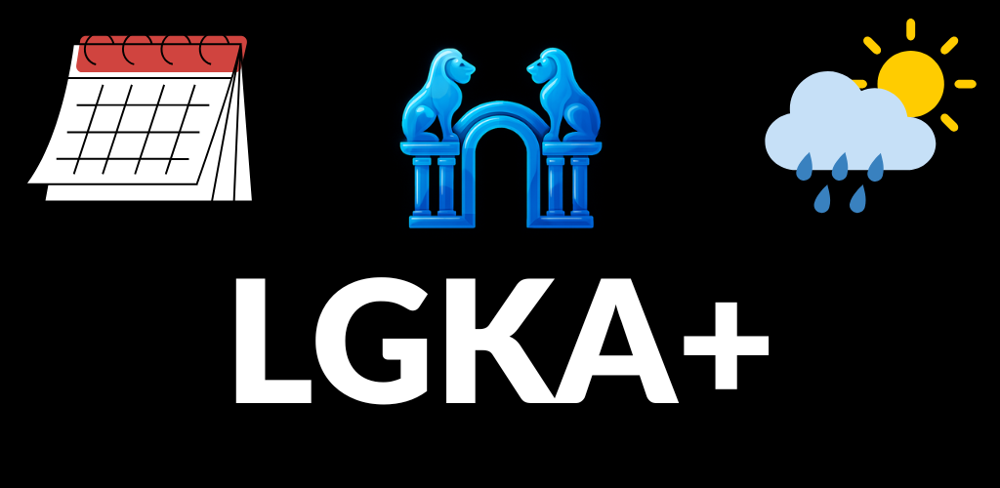

# LGKA+ – The app for Lessing-Gymnasium Karlsruhe

**LGKA+** is a mobile app for substitution plans, timetables, news, absence reporting, and weather data of the Lessing-Gymnasium Karlsruhe. Built with Flutter, Material Design 3.

---

## Features

- **Substitution plans** (today & tomorrow) with auto-refresh and caching
- **Timetables** (PDF) with class search
- **News and events**
- **PDF viewer** with zoom, share, and class lookup
- **Live weather** from [Open-Meteo](https://github.com/open-meteo/open-meteo) — current conditions and 3-day forecast
- **Customizable accent colors**
- **Absence reporting** via official school form

---

## License

Proprietary - [View License](LICENSE)  
Source code available for transparency only.

---

## Support

- [Report bugs](https://github.com/luka-loehr/LGKA/issues)  
- [luka@lukaloehr.com](mailto:luka@lukaloehr.com)  

---

Developed by [Luka Löhr](https://github.com/luka-loehr)
